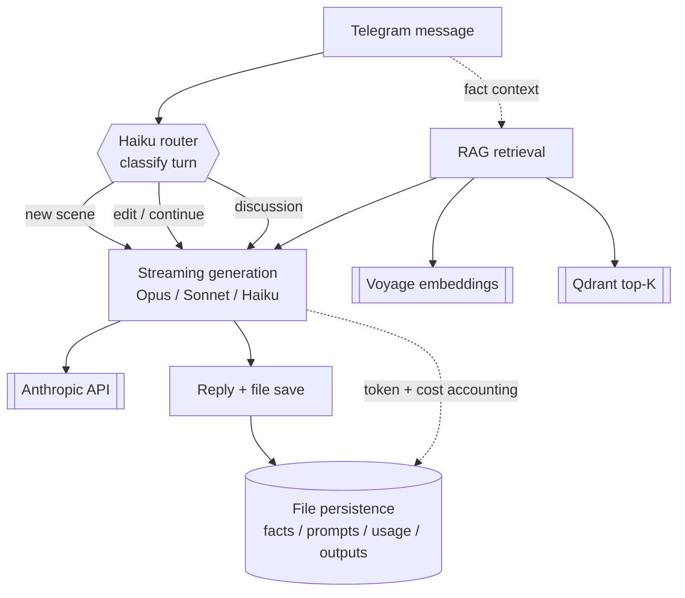

# Architecture — klgpff

*Read time: ~8–10 min. Code conforms to: `ccfa8db`.*

A Telegram-based assistant for long-form creative writing — an interactive fiction
tool that holds character canon across sessions, routes each turn to the right model,
and streams long scenes back as both chat and file.

This document isn't a feature list (that's the [README](../README.md)). It's the
reasoning. Why this shape, what I rejected, and what each choice cost me.

## What this is

I'll be honest about scale first, because it's the context that explains every
decision below.

There's one user — me. That's not a disclaimer I'm embarrassed about; it's the
operating condition I designed for, and it's a fact about *now*, not a ceiling.
A single-user creative-writing tool is a near-perfect proving ground for the part
of the stack I actually care about: LLM engineering. Model routing, retrieval,
resilient API plumbing, cost discipline — those problems are real at one user and
identical in shape at a thousand. The headcount is small; the engineering bar isn't.

So I held the bar where it'd be on a team. Dockerized, auto-deployed, persistence
that survives restarts, graceful degradation when a dependency is down. Not because
one user demands it — because the discipline is the point, and discipline you only
practice under load is discipline you don't have.

## Decisions I'm proud of

### 1. Raw Anthropic API over a managed platform

**Context.** Long-form creative writing needs consistency the consumer surface
doesn't expose: a stable system prompt, deterministic model selection, and direct
control over generation params (`max_tokens`, streaming, caching). A managed
platform hands you a chat box and decides the rest.

**Choice.** I went straight to the **raw Anthropic API** and own the whole
generation stack — system prompt, which model answers which turn, how long the
output can run, what gets cached.

**Alternatives rejected.** A managed consumer platform. It's faster to start with
and gives you nothing where it matters: you can't pin the model per task, you can't
shape the system prompt as canon, you can't tune `max_tokens` for a 3000-word scene.
The abstraction is comfortable in exactly the places I needed it to be sharp.

**Trade-off.** I now own things a platform would've handled — auth, retries,
deprecations, cost accounting. That's more surface to maintain. I took it on
deliberately: the maturity move isn't avoiding the lower layer, it's knowing *where*
in the stack the control you need lives and choosing that altitude on purpose.

*The right abstraction layer is the lowest one you actually understand.*

### 2. Cost-aware model routing

**Context.** Not every turn deserves the flagship model. "Continue this scene" and
"what's her brother's name again?" cost the same under a naive setup, and that cost
is Opus rates.

**Choice.** A **Haiku classifier routes every turn** before generation: a new scene
goes to Opus, an edit or continuation to Sonnet, and discussion or short meta-talk
stays on Haiku. The classifier replies with a single token. There's a manual pin for
when I want to override it.

**Alternatives rejected.** Opus everywhere. Simpler, and 10–20× more expensive for no
gain on the mechanical turns — a classification doesn't write better because a frontier
model decided it. Routing pays for its own (cheap) inference many times over.

**Trade-off.** The router can misroute, and a wrong call means a turn answered by a
weaker model. I keep the classifier prompt tight and bilingual, default it to Haiku on
any error, and let me pin manually — but it's a probabilistic component in a hot path,
and I treat it like one.

*A model you pay Opus rates to echo one token is a budget leak with good manners.*

### 3. RAG over context-stuffing for character memory

**Context.** Character and world facts accumulate. Stuffing all of them into every
prompt inflates context, costs tokens on every turn, and — worse — buries the few
facts that matter for *this* scene under all the ones that don't.

**Choice.** Facts are **embedded (Voyage) and indexed in Qdrant**, and each turn pulls
the top-K semantically relevant to the current message instead of the whole pile. The
model sees what's relevant, not everything.

**Alternatives rejected.** Context-stuffing — every fact in every prompt. It's trivial
to build and it scales badly in two directions at once: token cost climbs linearly with
canon, and signal-to-noise drops, which is how you get a model contradicting an
established detail it technically "had."

**Trade-off.** Semantic retrieval can miss the one fact a scene needed. So retrieval
isn't load-bearing in the failure case: if Qdrant is unreachable, or the index hasn't
been populated yet, the bot **falls back to the full fact list** and lazily backfills
the index. Degraded, not broken.

*The cheapest token is the one you never put in the prompt.*

### 4. File-based persistence over a database

**Context.** Facts, prompts, model modes, usage counters, saved outputs — all need to
survive restarts. The total volume is tiny.

**Choice.** **Flat files on disk**, mounted as Docker volumes. JSON for structured
state, text for prompts and outputs. Legible, greppable, debuggable by `cat`.

**Alternatives rejected.** A real database. It buys concurrent writes, query power, and
migrations — none of which a single-user tool with kilobytes of state needs. It'd be
infrastructure carried for a scale I don't have.

**Trade-off.** No concurrent-write safety and no rich queries. Honest cost, and the
honest answer is that one user writing serially never hits it. The day a second writer
shows up, this is the first decision I revisit — and I'll know exactly why.

*A database you don't need is just latency with a schema.*

### 5. Model IDs in env, pricing keyed by alias

**Context.** Model IDs change. Versions get deprecated and the dated IDs stop
resolving.

**Choice.** Concrete model IDs live in **`.env` (`MODEL_OPUS` / `MODEL_SONNET` /
`MODEL_HAIKU`)**, and the pricing table is **keyed by alias** (`opus`/`sonnet`/`haiku`),
not by ID. Bumping a model version is a one-line config change, and the cost math
doesn't move with it.

**Alternatives rejected.** Hardcoded IDs in the source — including the pricing table.
That's what I had, and it failed exactly the way you'd predict: an Opus version was
deprecated, every call started returning 404, and the fix had to be a code edit and a
redeploy. Now it's a line in `.env`.

**Trade-off.** A small layer of indirection — the alias↔ID mapping has to stay
coherent, and usage logged under an old ID won't match the new pricing key. Cheap
insurance against a failure mode I've already lived through once.

*A hardcoded model ID is a deprecation notice with a delay.*

### 6. Streaming generation

**Context.** A long scene at a high `max_tokens` can take a while to generate, and the
SDK refuses non-streaming requests that might exceed its 10-minute ceiling.

**Choice.** The main generation path **streams** and assembles the final message from
the stream. The short, bounded calls — the router, the summarizer — stay non-streaming,
because they can't approach the limit and streaming would just be ceremony.

**Alternatives rejected.** Capping `max_tokens` low enough to dodge the limit. That
solves the wrong problem — it shortens the scenes to fit the transport, which is the one
thing a long-form tool can't trade away.

**Trade-off.** Streaming is more code on the hot path than a single blocking call. For
the turns that are the entire point of the product, it's the only correct shape.

*If the work can outlast the timeout, the connection has to outlast it too.*

## How it's built

**Stack.** Python (`python-telegram-bot`), the raw Anthropic SDK, Voyage for
embeddings, Qdrant for vector search, flat files for state. Packaged as a Docker
image; Qdrant runs as a sibling service in `docker-compose`. Deployment is a GitHub
Actions workflow that SSHes to the server on push to `main`, pulls, and rebuilds.

## How it evolved

It started as a **local script on a laptop** — one file, JSON facts on disk, run by
hand. That was the right size for proving the routing idea, and it stayed that size
until the idea was proven.

Then it moved to **Docker on a VPS**, with auto-deploy on push, so the thing I edit
on the laptop is the thing that runs. Persistence became volumes; the deploy became a
workflow instead of a manual `scp`.

**RAG arrived when the facts did.** Context-stuffing was fine while canon was small;
once the fact list crossed into the hundreds, the cost and the noise both crossed the
line where retrieval pays for itself. I didn't build RAG because it was interesting —
I built it when the prompt got fat.

**Models moved to env after a deprecation bit me.** A hardcoded Opus ID went 404 in
production. The fix was config-izing the IDs and re-keying pricing to aliases — which
is decision #5, written the day the lesson cost me a redeploy.

Each of those was reactive on purpose. I'd rather add the layer when the system tells
me it's needed than carry it speculatively from day one.

## What's next

Sequenced, with the reasoning for the order:

- **Generation-quality evals.** Before tuning anything, I want a way to measure
  "better" that isn't my gut. Everything downstream of this is guesswork until it
  exists, so it's first.
- **Observability (Langfuse).** Trace routing decisions, latencies, and cost per turn.
  I can't improve what I'm not watching, and right now the router is a probabilistic
  component I mostly trust on faith.
- **Reranking on top of RAG.** Retrieval is pure vector similarity today; a rerank pass
  would tighten which facts actually reach the prompt. This comes *after* evals, so I
  can prove it helps instead of assuming it does.
- **A scoped seam for external device integration.** There's a deliberately narrow
  abstraction boundary laid in for it — designed, not built. I'm not committing to the
  shape yet, because I'd rather ship a small thing I fully understand than a big one I'm
  pretending to.

The through-line under all of it: AI/LLM engineering — model routing, resilient LLM
plumbing, retrieval — is the discipline this project exists to practice, and the only
way I know to learn it is by shipping it.

*A roadmap is a set of bets; the honest ones admit which bet they haven't placed yet.*
